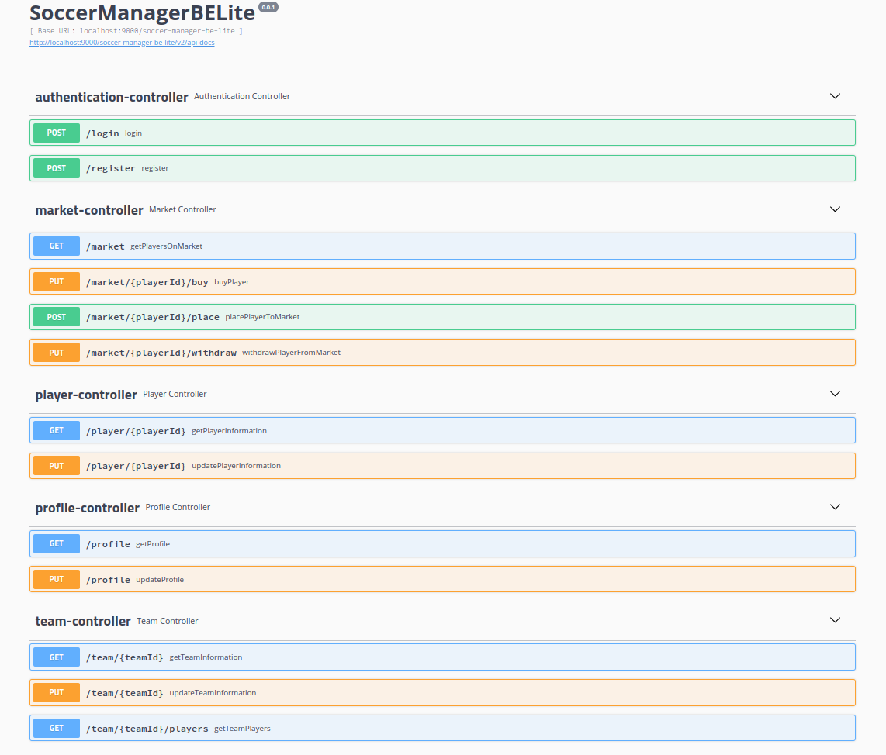
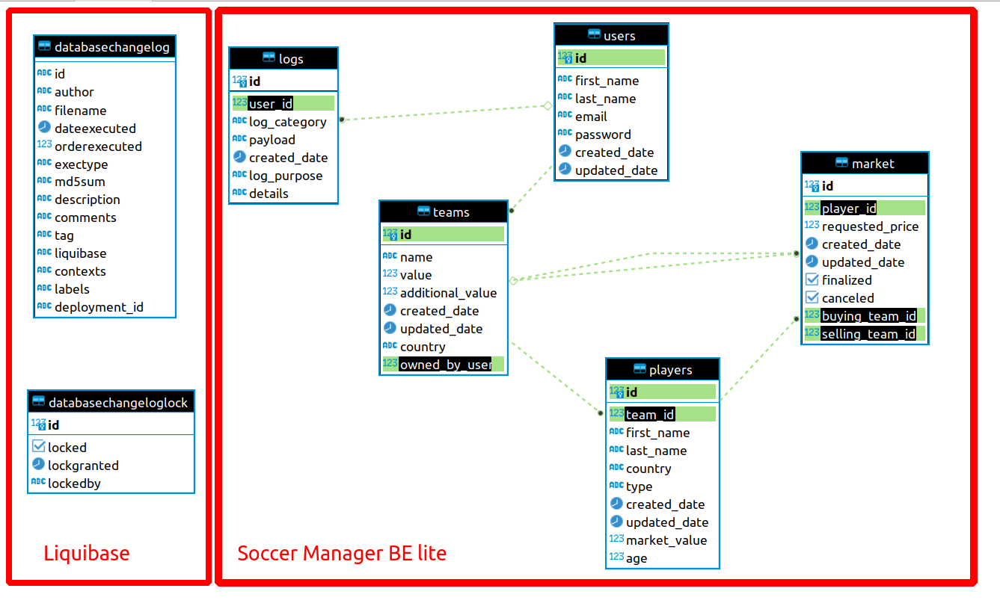

# SoccerManagerBELite

## 0. Local development

```
# no args => defaults to docker
./start.sh [gradle|docker]
```

## 1. Local Swagger

[SWAGGER LINK](http://localhost:9000/soccer-manager-be-lite/swagger-ui.html)

-   

## 2. Deployment

### 2.1 Native deployment on linux node

```
bash deployment/native/deploy.sh
```

### 2.2 Deployment using docker images

```
bash deployment/docker/deploy.sh
```

## 3. Security

-   "/login", "/register" and `swagger` are not secured.
-   Everything else is secured using JWT.

## 4. Migration

-   Liquibase with postgresql native ddl.

## 5. Exception Handling

-   Built app exception: `ApiException`
-   Everything thrown inside controllers is caught by `ApiExceptionHandler`
-   Response code when exceptions are thrown can be defined in `ExceptionDefinition`

## 6. Logging

-   `LogService` logs to database
-   `LogService` logs to stdout and file using `@Slf4j`.

## 7. Swagger

With respect to the place of deployment, the swagger is found at:

```
{{protocol}}://{{ip}}:{{port}}{{basePath}}/swagger-ui.html
```

## 8. Postman

Postman collection:

```
documentation/postman/SoccerManagerBELiteApplication.postman_collection.json
```

Postman environments:

```
documentation/postman/environments/Local.postman_environment.json

documentation/postman/environments/Server.postman_environment.json
```

## 9. Database

### Technology

-   Postgresql.
-   Database used for the project found in `database/docker-compose-yml` file.

### Architecture

-   

## 10. Controllers

```
AuthenticationController

POST /register
POST /login
```

```
ProfileController

GET /profile
PUT /profile
```

```
TeamController

GET /team/{teamId}
PUT /team/{teamId}
GET /team/{teamId}/players
```

```
PlayerController

GET /player/{playerId}
PUT /player/{playerId}
```

```
MarketController

GET /market
POST /market/{playerId}/place
POST /market/{playerId}/withdraw
POST /market/{playerId}/buy
```

## 11. Nice to have

-   [ ] Sorting and Filtering
-   [ ] Paginate the list responses
-   [ ] Node level synchronization mechanism
-   [ ] Cluster level synchronization mechanism
-   [ ] A.O.P. logging mechanism
-   [ ] Mailing
-   [ ] Recurrent jobs for system health check
-   [ ] Integration tests
-   [ ] Unit tests
-   [ ] Metrics
-   [ ] Alerts
-   [ ] Versioning and backups
